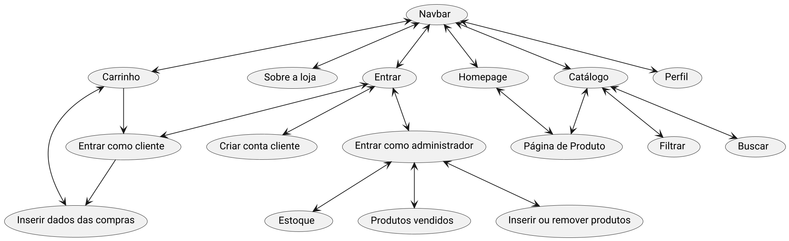

# Relatório de Projeto

Esse é o projeto de uma livraria virtual desenvolvido para
a disciplina Introdução de Desenvolvimento Web (SCC0219).
Os seguintes alunos participaram do projeto:
- Gabriel Martins Monteiro, N°USP: 14572099
- Hélio Márcio Cabral Santos, N°USP: 14577862
- Murilo Fonseca de Matos, N°USP: 13719065

## Requisitos

O projeto necessitará dois usuários:
- **Administrador**: responsável por gerenciar os recursos, nesse caso os produtos da loja.
- **Cliente**: esses são os usuários que usufruiram do serviço.

É preciso armazenar os seguintes dados:
- **Administrador**: nome, id, telefone, email.
- **Cliente**: nome, id, endereço, telefone, email.
- **Produto**: nome, id, foto, descrição, preço, quantidade no estoque, quantidade vendida, gênero, autor, editora.

Os administradores teram livre acesso para gerenciar os recursos, como adicionar e remover livros.

## Descrição
O projeto é uma livraria online que tem como objetivo oferecer as seguintes funcionalidades:
- Cadastro de perfis e Login.
- Adicionar ou remover produtos do carrinho.
- Finalização de compras.
- Filtrar por gênero, autor, editor.
- Busca por nome.
- Adicionar ou remover novos produtos no catálogo (administrador).

Para que as funcionalidades sejam implementadas de maneira adequadas, é preciso
que os registros descrito no tópico "Requisitos" sejam devidamente armazenados.

## Diagrama de navegação


Todos os mockups estão na pasta "mockup/".

## Comentários sobre o código

Utilizamos algumas bibliotecas, como react-router-dom para fazer as ligações
entre as páginas e a navbar, e também a toastify, biblioteca para notificações.
Utilizamos notificações para ter feedback ao usuário de que os livros foram
adicionados no carrinho, por exemplo.

O código está organizado na seguinte estrutura:
- **milestone2/src/pages**: Equivalente às páginas html.
- **milestone2/src/componentes**: Componentes modulares, que são reutilizados ao decorrer do código.
- **milestone2/src/contexts**: Parte que utiliza a função createContext() do react para guardar contexto
da aplicação, de forma que informações como itens no carrinho e contas também são salvas mesmo
que a página seja trocada.

Também utilizamos _mock objects_ para realizar as funções de API. No arquivo que armazena
contexto de login, temos algumas funções responsáveis pelo login e o signup ao servidor,
em que elas utilizam um timer de javascript para simular o tempo de resposta do servidor.

## Plano de testes

Nós fizemos alguns testes manuais. Eles são:
- Comprar um produto
- Adicionar novo produto
- Remover um produto
- Atualizar um produto
- Criar novo usuário
- Login
- Busca
- Filtro

## Resultado dos testes

### Comprar um produto


### Adicionar novo produto


### Remover um produto


### Atualizar um produto


### Criar novo usuário


### Login


### Busca


### Filtro


## Procedimentos de build

Para executar o projeto, instale primeiro o _nodejs_, o _npm_ e o _git_ através
do seu instalador de pacote. Depois, basta digitar em seu terminal:

```
git clone https://github.com/GabrielMtins/scc0219web.git
cd ssc0219web/milestone2
npm install
npm start
```

## Problemas encontrados

Foi encontrando um problema na página de checkout, onde não é possível mais
sair dela após ela ser acessada.

## Comentários

